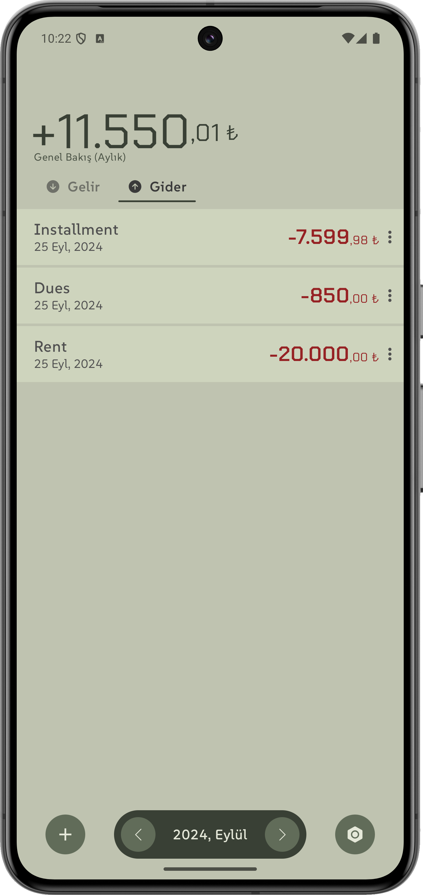
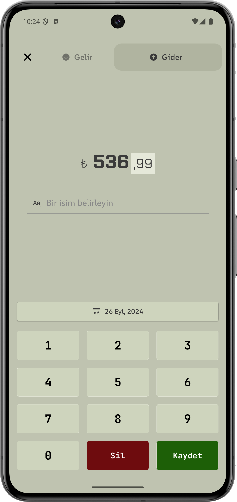
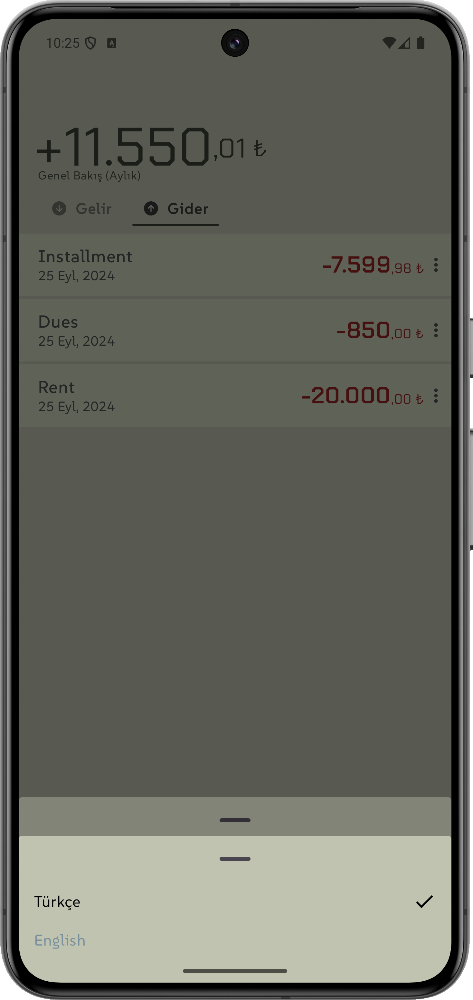
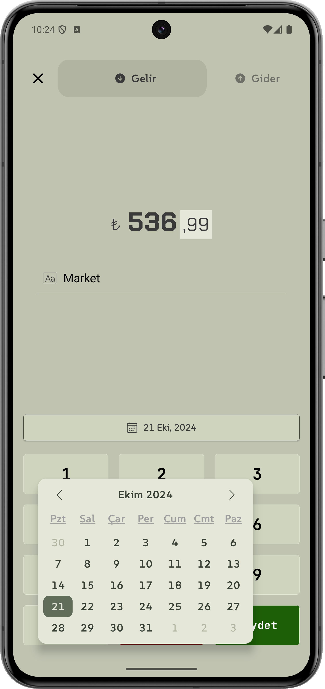
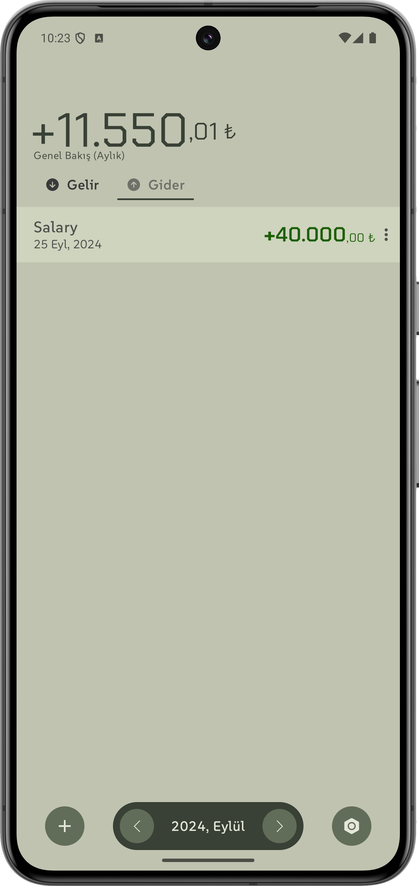

# Expense Management Uygulaması 
🔗 [Google Play Store](https://play.google.com/store/apps/details?id=tosbik.ao.parayonetimi "Google Play Store")

Para Yönetimi, kişisel harcamalarınızı ve gelirlerinizi yönetmek için geliştirilmiş modern bir Android uygulamasıdır. Uygulama, Jetpack Compose kullanılarak geliştirilmiş olup veriler Room veritabanı ile lokal olarak saklanır. Hilt ile dependency injection yapılmıştır ve Navigation Component kullanılarak uygulama içi gezinti sağlanır. Girmiş olduğunuz veriler kimseyle paylaşılmaz, yanlızca cihazınızda saklanır.

## Ekran Görüntüleri

| Ana Ekran | Yeni Harcama Ekranı | Ayarlar Ekranı |
|-----------|---------------------|----------------|
|  |  |  |

| Yeni Harcama Ekranı | Gelir Ekleme Ekranı | Gelir Detayları |
|-----------------|---------------------|-----------------|
|  |  |  |

## Özellikler

- **Jetpack Compose ile Modern Arayüz**: Compose kullanılarak oluşturulmuş dinamik ve akıcı kullanıcı arayüzü.
- **Veri Yönetimi (Room)**: Gelir ve gider verileriniz lokal veritabanında saklanır.
- **Dependency Injection (Hilt)**: Hilt kullanarak uygulamada bağımlılık yönetimi yapılmıştır.
- **Navigation Component**: Ekranlar arasında gezinti yapmanıza olanak tanır.
- **MVVM Mimarisi**: Model-View-ViewModel (MVVM) tasarım deseni kullanılarak geliştirilmiştir.
- **Harcamalar ve Gelirler**: Kategorize edilmiş gelir ve gider yönetimi.
- **Coroutines ile Asenkron İşlemler**: Asenkron veri işlemleri ve ağ çağrıları Kotlin Coroutines kullanılarak yapılmıştır.
- **Flow ile Reaktif Veri Akışı**: Veri akışları, Kotlin Flow kullanılarak işlenmiştir.

## Teknolojiler ve Kullanılan Kütüphaneler

- **Jetpack Compose**: Android'in modern UI kütüphanesi.
- **Room**: Lokal veritabanı çözümü.
- **Hilt**: Dependency injection işlemleri için kullanılır.
- **Navigation Component**: Ekranlar arası gezinti işlemleri için kullanılır.
- **Kotlin Coroutines**: Asenkron işlemler ve çoklu iş parçacığı yönetimi.
- **Kotlin Flow**: Reaktif veri akışı yönetimi için kullanılır.
- **LiveData**: UI ile veri yönetimi için kullanılır.

## Proje Yapısı
```bash
.
├── common                      # Ortak kullanılacak sınıflar ve fonksiyonlar
│   ├── ComposableExtensions.kt  # Jetpack Compose uzantıları
│   ├── Constants.kt             # Uygulama genel sabitler
│   ├── CurrencyType.kt          # Farklı para birimi türleri
│   └── LocalizationUtils.kt     # Lokalizasyon yardımcı sınıfları
├── data
│   ├── model                    # Veritabanı modelleri
│   ├── repository               # Veritabanı işlemleri ve veri yönetimi
│   └── source                   # Veri kaynakları
├── di
│   └── AppModule.kt             # Hilt modülleri
├── domain
│   ├── model                    # Domain katmanı modelleri
│   ├── usecase                  # İş kuralları ve iş mantığı
│   └── viewmodel                # Uygulama ViewModel sınıfları
├── ui
│   ├── components               # Ortak UI bileşenleri (button, dialog, vs.)
│   ├── home                     # Ana ekran ve ilgili bileşenler
│   │   ├── HomeScreen.kt        # Ana ekranın Composable işlevleri
│   │   └── HomeViewModel.kt     # Ana ekranın ViewModel katmanı
│   ├── navigation               # Uygulama içi ekran geçişleri (NavHost, NavGraph)
│   ├── newexpense               # Yeni harcama/gider ekleme ekranı
│   ├── settings                 # Ayarlar ekranı
│   └── theme                    # Uygulama tema yönetimi
├── utils
│   ├── Functions.kt             # Yardımcı fonksiyonlar
│   └── MainApplication.kt       # Uygulama giriş noktası
└── MainActivity.kt              # Ana Activity (Jetpack Compose)
```

## Proje Kurulum
1. Projeyi klonlayın
```bash
git clone https://github.com/ahmet-ozberk/ExpenseManagement-Compose.git
```
2.	Android Studio ile projeyi açın ve bağımlılıkları indirin.
3.	Uygulamayı cihazınıza ya da emulator’e çalıştırın.
